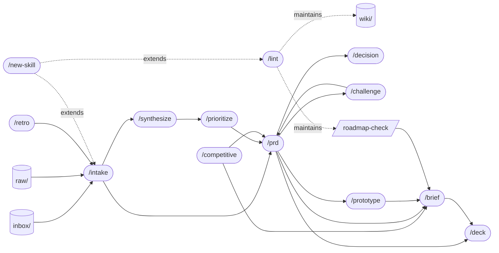

# Skill Graph

How skills chain in practice. Not a required sequence — jump in anywhere.

## Typical flow

## Common chains

**Discovery → ship**
`/intake` → `/synthesize` → `/prioritize` → `/prd` → `/challenge` → `/prototype` → `/brief` → `/deck`

**Strategic decision**
`/competitive` → `/decision` → `/brief` → `/deck`

**Roadmap review**
`/roadmap-check` → `/brief` → `/deck`

**Quarterly cycle**
`/retro` → `/intake` (carryovers) → `/prioritize` → `/prd` → ...

**Maintenance (always available)**
`/lint` runs anytime. Catches contradictions and stale claims that the other skills can't see across the whole workspace.

**Extending the library**
`/new-skill` is the meta-skill. Run it when a recurring workflow doesn't fit any of the 13 PM skills. Scaffolds folder, frontmatter, evals, and registers the new skill in AGENTS.md / SCHEMA.md / README.md / GUIDE.md.

## When skills compose

| You ran… | Often you next want… |
|---|---|
| `/intake` | `/prd` (promote a card to a draft) or `/synthesize` (cluster related cards) |
| `/synthesize` | `/prioritize` (rank the themes) |
| `/prioritize` | `/prd` (spec the top items) |
| `/prd` | `/challenge` (stress-test) → `/prototype` (validate) → `/brief` (communicate) → `/deck` (present) |
| `/decision` | `/brief` (announce) → `/prd` (if it leads to building) |
| `/competitive` | `/prd` (close gaps) or `/brief` (exec context) |
| `/roadmap-check` | `/brief` (status) or `/decision` (de-conflict) |
| `/retro` | `/intake` (open items) → `/prioritize` (next quarter) |

## Anti-chains (don't do these)

- `/prd` without `/intake` or `/synthesize` upstream — you're guessing at the requirement.
- `/deck` without a `/brief` or `/prd` first — there's no substance to render.
- `/decision` without three options — it's a binary, not a decision.
- `/challenge` after `Approved` PRDs — challenge is for drafts, not committed plans.
